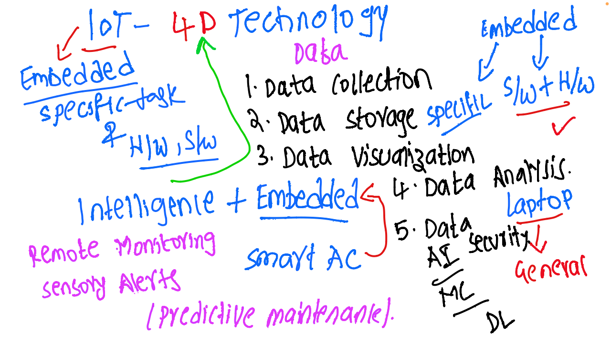

# IoT and Embedded Systems - Discussion 1

This document covers the key concepts and insights from the first discussion in the IoT and Embedded Systems session. The focus is on understanding the fundamentals of IoT, data handling, intelligent embedded systems, and their applications.

---

## Table of Contents
1. [Introduction to IoT and Embedded Systems](#introduction-to-iot-and-embedded-systems)
2. [4D Approach in Technology](#4d-approach-in-technology)
3. [Intelligent + Embedded Systems](#intelligent--embedded-systems)
4. [Key Components and Functions](#key-components-and-functions)
5. [Technological Integration](#technological-integration)
6. [Data Security in IoT and Embedded Systems](#data-security-in-iot-and-embedded-systems)
7. [Technologies Used](#technologies-used)
8. [Practical Applications](#practical-applications)
9. [Benefits of IoT and Embedded Systems](#benefits-of-iot-and-embedded-systems)
10. [Session Diagram](#session-diagram)

---

## 1. Introduction to IoT and Embedded Systems
- **IoT (Internet of Things)**: A network of interconnected devices capable of collecting, analyzing, and acting on data to provide value in various applications.
- **Embedded Systems**: Hardware and software designed to perform specific tasks, often as part of larger systems.
- **Purpose**: Both IoT and embedded systems aim to enhance automation, intelligence, and efficiency in numerous fields, from industrial automation to smart homes.

## 2. 4D Approach in Technology
   - **Data Cycle**:
     1. **Data Collection**: Capturing data from various sensors and devices.
     2. **Data Storage**: Securely storing data for future analysis and reference.
     3. **Data Visualization**: Converting data into visual formats for easier interpretation and decision-making.
     4. **Data Analysis and Security**: Analyzing data to extract insights and implementing security measures to protect it.

## 3. Intelligent + Embedded Systems
- Combining embedded systems with AI and ML allows for intelligent applications.
- **Examples**:
  - **Smart AC**: Uses sensors and AI to automatically adjust settings based on room conditions.
  - **Predictive Maintenance**: Uses sensors to monitor equipment and predict failures, allowing proactive maintenance.

## 4. Key Components and Functions
- **Remote Monitoring**: Allows for real-time monitoring of environments or equipment.
- **Sensory Alerts**: Generates alerts based on data from sensors for prompt actions.
- **Predictive Maintenance**: Utilizes data to predict and prevent equipment failures, improving reliability.

## 5. Technological Integration
- **Hardware (H/W) + Software (S/W)**: Essential integration in IoT and embedded systems to fulfill specific tasks.
- **Specific vs. General Use**:
  - **Embedded Systems**: Tailored for specific tasks like monitoring and controlling.
  - **General Computing Devices**: Used for broader analysis and development but are not real-time integrated systems.

## 6. Data Security in IoT and Embedded Systems
- **Importance**: Critical in IoT systems to protect sensitive information and prevent unauthorized access.
- **Security Measures**:
  - **Encryption**: Securing data in transit and storage.
  - **Access Control**: Ensuring only authorized users can access data.

## 7. Technologies Used
- **AI (Artificial Intelligence)**: Enables intelligent data processing and decision-making.
- **ML (Machine Learning)**: Allows systems to recognize patterns and optimize operations.
- **DL (Deep Learning)**: Provides advanced data analysis capabilities, especially in predictive applications.

## 8. Practical Applications
- **Smart AC Systems**: Embedded sensors and AI adjust the AC based on room conditions.
- **Predictive Maintenance for Industrial Equipment**: Sensors monitor machinery, and analytics predict when maintenance is needed.
- **Remote Monitoring**: Used in healthcare, agriculture, and industrial sectors for real-time condition tracking.

## 9. Benefits of IoT and Embedded Systems
- **Efficiency**: Reduces the need for manual intervention and speeds up processes.
- **Cost Savings**: Optimizes resource use and reduces maintenance costs.
- **Enhanced Security**: Protects data and builds trust in IoT applications through robust security measures.

## 10. Session Diagram

