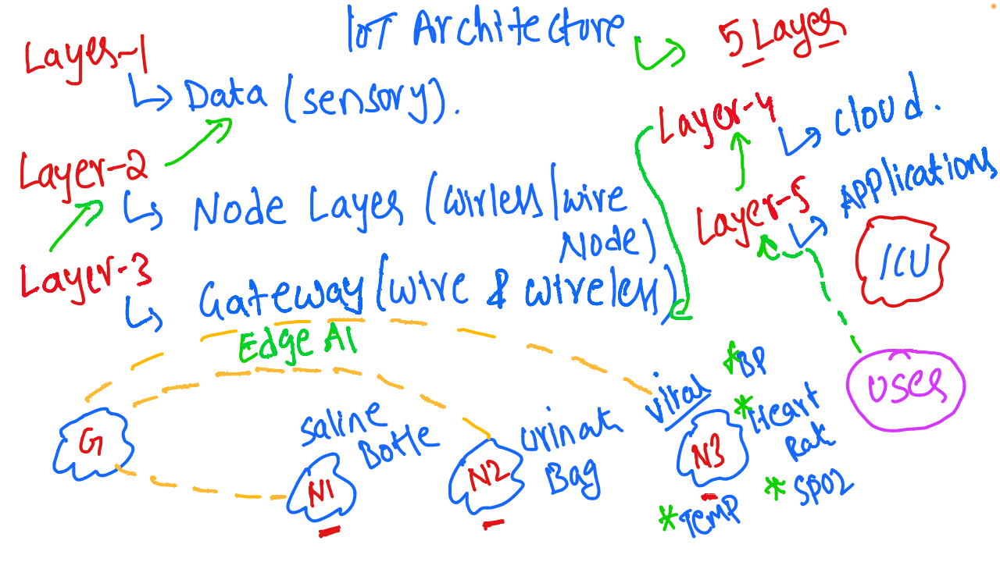

# IoT and Embedded Systems - Discussion 2

This document summarizes the second discussion in the IoT and Embedded Systems session, focusing on the detailed architecture of IoT systems and the various layers involved in data processing, transmission, and application.

---

## Table of Contents
1. [5-Layer IoT Architecture](#5-layer-iot-architecture)
2. [Layer 1: Data (Sensory) Layer](#layer-1-data-sensory-layer)
3. [Layer 2: Node Layer](#layer-2-node-layer)
4. [Layer 3: Gateway Layer](#layer-3-gateway-layer)
5. [Layer 4: Cloud Layer](#layer-4-cloud-layer)
6. [Layer 5: Application Layer](#layer-5-application-layer)
7. [Healthcare Monitoring System Use Case](#healthcare-monitoring-system-use-case)
8. [Session Diagram](#session-diagram)

---

## 1. 5-Layer IoT Architecture

The IoT architecture consists of five key layers, each responsible for different tasks in the data flow from sensors to end-user applications.

1. **Layer 1**: Data (Sensory) Layer
2. **Layer 2**: Node Layer
3. **Layer 3**: Gateway Layer
4. **Layer 4**: Cloud Layer
5. **Layer 5**: Application Layer

## 2. Layer 1: Data (Sensory) Layer
   - **Purpose**: This is the foundational layer responsible for collecting raw data from various sensors.
   - **Components**: Sensors that measure environmental or physical parameters, such as temperature, blood pressure, heart rate, etc.
   - **Examples**: Sensors for monitoring equipment, environmental conditions, and vital signs in healthcare settings.

## 3. Layer 2: Node Layer
   - **Description**: This layer comprises nodes that can be connected via wired or wireless communication.
   - **Function**: Aggregates data from multiple sensors and prepares it for transmission to the next layer.
   - **Examples of Nodes**:
     - **N1**: Sensor for monitoring a saline bottle.
     - **N2**: Sensor for monitoring a urine bag.
     - **N3**: Sensor for monitoring vital signs (e.g., temperature, blood pressure, heart rate, SpO2).

## 4. Layer 3: Gateway Layer
   - **Description**: Serves as the bridge between the nodes and the cloud, handling data routing and initial processing.
   - **Connection Type**: Supports both wired and wireless communication.
   - **Edge AI Integration**: Basic AI capabilities can be implemented at this layer for real-time data analysis.
   - **Function**: Aggregates and pre-processes data, reducing the amount of information sent to the cloud to minimize latency.

## 5. Layer 4: Cloud Layer
   - **Description**: Provides large-scale data storage and processing capabilities.
   - **Functions**:
     - **Data Storage**: Keeps historical data for in-depth analysis.
     - **Advanced Analytics**: Applies machine learning models and complex analyses on the data.
   - **Examples of Cloud Platforms**: AWS, Azure, Google Cloud.
   - **IoT-Specific Clouds**: ThingWorx, ThingSpeak, and Blynk are dedicated platforms for IoT data handling and management.

## 6. Layer 5: Application Layer
   - **Purpose**: This layer interacts with end-users through applications, providing data visualization, alerts, and controls.
   - **Application Types**:
     - **Web Applications**: Built with JavaScript and other web technologies.
     - **Mobile Applications**: Developed using Java, Kotlin, React Native, or Flutter.
   - **Use Cases**: Real-time monitoring in ICUs, environmental monitoring, industrial control systems.

## 7. Healthcare Monitoring System Use Case

This architecture is applicable in healthcare, particularly in ICU settings for patient monitoring:
   - **Gateway (G)**: Aggregates data from sensors and performs edge processing.
   - **Node Examples**:
     - **N1**: Monitors saline bottle levels.
     - **N2**: Monitors urine bag levels.
     - **N3**: Monitors vital signs (e.g., temperature, blood pressure).
   - **Application Layer**: Alerts healthcare professionals in real-time if any monitored parameter goes beyond safe limits.

## 8. Session Diagram

