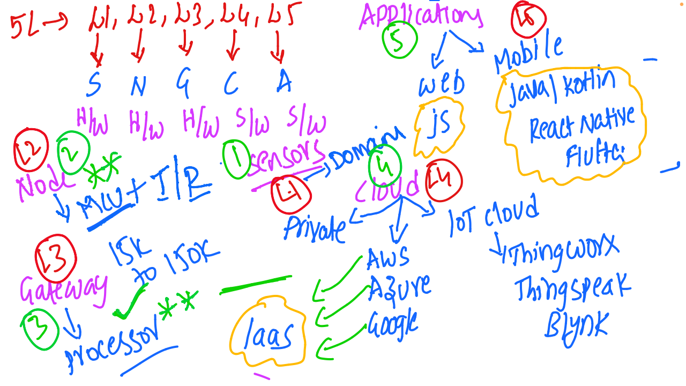

# IoT and Embedded Systems - Discussion 3

This document summarizes the third discussion in the IoT and Embedded Systems session, focusing on the in-depth structure of the 5-layer IoT architecture, hardware and software components, cloud integration, and application development for IoT systems.

---

## Table of Contents
1. [5-Layer IoT Architecture Overview](#5-layer-iot-architecture-overview)
2. [Layer Details](#layer-details)
   - [Layer 1: Sensory Layer](#layer-1-sensory-layer)
   - [Layer 2: Node Layer](#layer-2-node-layer)
   - [Layer 3: Gateway Layer](#layer-3-gateway-layer)
   - [Layer 4: Cloud Layer](#layer-4-cloud-layer)
   - [Layer 5: Application Layer](#layer-5-application-layer)
3. [IoT Development Platforms and Technologies](#iot-development-platforms-and-technologies)
4. [Application Development](#application-development)
5. [Session Diagram](#session-diagram)

---

## 1. 5-Layer IoT Architecture Overview

The IoT system architecture is built on a 5-layer structure, each responsible for a distinct function in data processing and transmission from sensors to the end-user application.

---

## 2. Layer Details

### Layer 1: Sensory Layer
   - **Description**: The base layer responsible for data collection through various sensors.
   - **Components**: Sensors capture data such as temperature, humidity, pressure, etc.
   - **Connection**: Typically hardware components connected to microcontrollers.

### Layer 2: Node Layer
   - **Function**: Aggregates data from the sensory layer. Nodes can communicate either through wired or wireless connections.
   - **Protocols Used**: Common protocols include **MQTT** and **IR**.
   - **Components**: Hardware includes microcontrollers for data processing, configured to support communication protocols for efficient data transfer.

### Layer 3: Gateway Layer
   - **Role**: Bridges nodes with the cloud, transmitting data while providing initial processing.
   - **Hardware Requirements**: Requires a processor capable of handling data throughput between 15K to 150K, depending on application needs.
   - **Components**: Often integrates microcontrollers and processors to support both wired and wireless connections.

### Layer 4: Cloud Layer
   - **Purpose**: Provides large-scale data storage, analytics, and management.
   - **Cloud Providers**: Major platforms include AWS, Azure, and Google Cloud.
   - **IaaS (Infrastructure as a Service)**: Offers scalable infrastructure for IoT applications, supporting IoT-specific platforms such as **ThingWorx**, **ThingSpeak**, and **Blynk**.

### Layer 5: Application Layer
   - **Purpose**: The top layer where data is presented to end-users through applications.
   - **Application Types**:
     - **Web Applications**: Built using JavaScript (JS) for accessible visualization.
     - **Mobile Applications**: Developed using languages like Java, Kotlin, React Native, and Flutter for cross-platform deployment.
   - **Example Uses**: Real-time monitoring, data visualization, control of IoT devices.

---

## 3. IoT Development Platforms and Technologies
   - **Communication Protocols**:
     - **MQTT**: Lightweight messaging protocol for resource-constrained devices.
     - **IR (Infrared)**: Used in short-range, low-power applications.
   - **Cloud Platforms**:
     - **AWS, Azure, Google Cloud**: Providers of IaaS for hosting IoT applications and data.
     - **IoT-Specific Platforms**: **ThingWorx**, **ThingSpeak**, **Blynk** for specialized IoT management and data processing.

---

## 4. Application Development
   - **Mobile Application Development**:
     - **Languages and Frameworks**: Java, Kotlin for Android; React Native and Flutter for cross-platform applications.
   - **Web Application Development**:
     - **Technologies Used**: JavaScript (JS) and related frameworks for interactive, real-time data visualization.

---

## 5. Session Diagram

