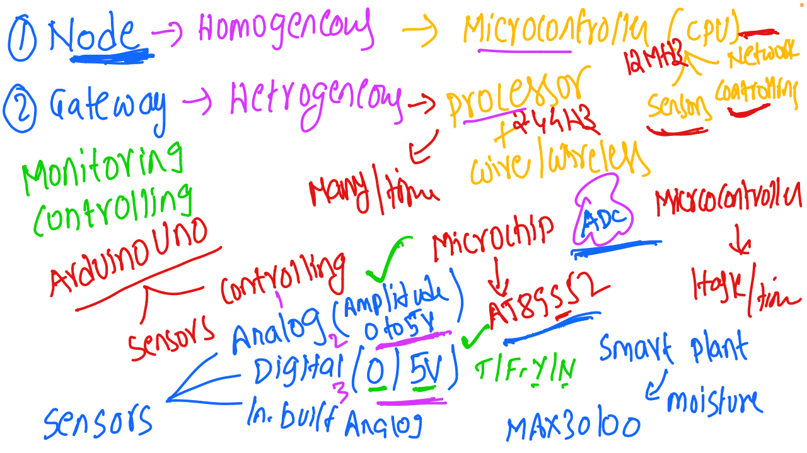

# IoT and Embedded Systems - Discussion 4

This document summarizes the fourth discussion in the IoT and Embedded Systems session, focusing on the architecture and roles of nodes and gateways, types of microcontrollers, and signal handling in IoT applications.

---

## Table of Contents
1. [Node and Gateway Architecture](#node-and-gateway-architecture)
2. [Node Layer](#node-layer)
3. [Gateway Layer](#gateway-layer)
4. [Microcontrollers and Processors](#microcontrollers-and-processors)
5. [Analog and Digital Signals](#analog-and-digital-signals)
6. [Application Example: Smart Plant Monitoring System](#application-example-smart-plant-monitoring-system)
7. [Session Diagram](#session-diagram)

---

## 1. Node and Gateway Architecture

In IoT systems, **nodes** and **gateways** serve different purposes:
   - **Node Layer**: Focused on data collection from sensors and initial data processing.
   - **Gateway Layer**: Acts as a bridge to the cloud and provides additional data processing and communication capabilities.

---

## 2. Node Layer

- **Homogeneous Structure**: Nodes are often homogeneous, meaning they use similar types of microcontrollers and perform uniform tasks.
- **Primary Component**: Microcontrollers, responsible for collecting and processing data from sensors.
- **Example Sensors in Nodes**:
  - **Analog Sensors**: Measure continuous values (e.g., 0 to 5V).
  - **Digital Sensors**: Measure discrete states, typically 0 or 5V.

---

## 3. Gateway Layer

- **Heterogeneous Structure**: Unlike nodes, gateways are heterogeneous and integrate multiple hardware components for different tasks.
- **Primary Component**: Processors, which handle data routing and more complex processing.
- **Communication**:
  - Gateways support both wired and wireless communication.
  - Data transfer protocols include RS-485, SPI, I2C, and UART.
- **Functionality**:
  - Provides initial data filtering and aggregation before transmitting to the cloud.
  - Edge AI can be implemented at this layer for local data processing.

---

## 4. Microcontrollers and Processors

- **Common Microcontrollers**:
  - **ATmega328** (used in Arduino): Popular for small IoT projects.
  - **AT89S52**: Used in basic embedded systems.
  - **Microchip Microcontrollers**: Suitable for both monitoring and controlling applications.
- **Example Development Board**:
  - **Arduino Uno**: Often used for controlling sensors and collecting data.

---

## 5. Analog and Digital Signals

- **Analog Signals**:
  - Continuous signals with a range, usually between 0 and 5V.
  - Processed by Analog-to-Digital Converters (ADC) in microcontrollers.
- **Digital Signals**:
  - Discrete, binary signals (e.g., 0 or 5V).
  - Directly processed by digital systems for binary data (on/off states).

---

## 6. Application Example: Smart Plant Monitoring System

An example application using IoT and embedded systems is a **Smart Plant Monitoring System**, where sensors measure environmental conditions for optimal plant growth.

- **Soil Moisture Sensor**: Measures soil moisture levels to determine irrigation needs.
- **Sensors**:
  - **MAX30100**: Can be used for other applications like monitoring environmental parameters.
- **Microcontroller**: Arduino Uno is used to process sensor data and control outputs based on environmental readings.

---

## 7. Session Diagram

