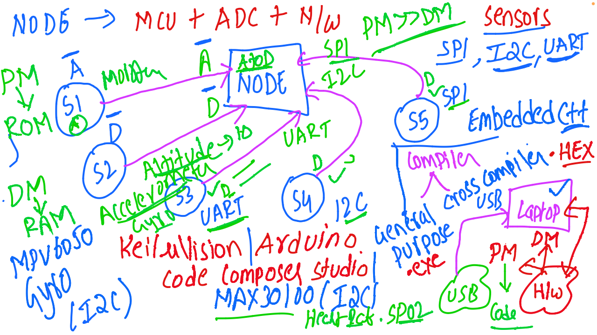

# IoT and Embedded Systems - Discussion 5

This document summarizes the fifth discussion in the IoT and Embedded Systems session, focusing on the technical details of IoT node architecture, communication protocols, sensor interfacing, and embedded system programming.

---

## Table of Contents
1. [Node Architecture](#node-architecture)
2. [Sensor Communication Protocols](#sensor-communication-protocols)
3. [Embedded System Development Tools](#embedded-system-development-tools)
4. [Programming Workflow in Embedded Systems](#programming-workflow-in-embedded-systems)
5. [Application Examples](#application-examples)
6. [Session Diagram](#session-diagram)

---

## 1. Node Architecture

- **Key Components**:
  - **MCU (Microcontroller Unit)**: The core component in IoT nodes, often paired with an **ADC (Analog-to-Digital Converter)**.
  - **Memory**:
    - **Program Memory (PM)**: Stores the program code (typically ROM).
    - **Data Memory (DM)**: Handles runtime data storage (typically RAM).
  - **Communication Interfaces**: Enables connections to sensors and other nodes through protocols such as SPI, I2C, and UART.

- **Example Sensors**:
  - **S1**: General-purpose sensor.
  - **S2**: Accelerometer (e.g., MPU6050) for motion detection.
  - **S3**: Altitude sensor.
  - **S4 and S5**: Sensors configured with specific communication protocols like I2C or SPI.

---

## 2. Sensor Communication Protocols

- **SPI (Serial Peripheral Interface)**: High-speed communication protocol between the MCU and sensors.
- **I2C (Inter-Integrated Circuit)**: Used for connecting multiple low-speed peripherals.
- **UART (Universal Asynchronous Receiver-Transmitter)**: Facilitates serial communication between the MCU and other devices.

- **Example Sensors**:
  - **MPU6050**: Accelerometer and gyroscope connected via I2C for motion/orientation data.
  - **MAX30100**: Measures heart rate and SpO2, connected via I2C.

---

## 3. Embedded System Development Tools

- **Keil uVision**: IDE for ARM microcontrollers, commonly used in embedded development.
- **Arduino IDE**: User-friendly platform for programming Arduino boards and compatible MCUs.
- **Code Composer Studio**: Development environment for Texas Instruments (TI) microcontrollers.
- **Compilation and Cross Compilation**:
  - Code is typically written in C/C++ and cross-compiled to a machine-readable format (e.g., HEX files) for embedded systems.

---

## 4. Programming Workflow in Embedded Systems

- **Code Development**: Written in C/C++ or compatible languages using IDEs like Keil uVision, Arduino, or Code Composer Studio.
- **Compilation**: The source code is compiled to a HEX or binary format.
- **Uploading to MCU**:
  - The compiled code is uploaded to the MCU (e.g., Arduino) through a USB connection.
- **Execution**: Once uploaded, the MCU executes the code to control and monitor sensors and perform designated tasks.

---

## 5. Application Examples

- **General-Purpose Monitoring**: Nodes monitor environmental or physical parameters and communicate with a central gateway.
- **Health Monitoring**: The MAX30100 sensor tracks heart rate and SpO2, useful in healthcare applications.
- **Attitude Sensing**: Nodes equipped with accelerometers and gyroscopes (e.g., MPU6050) monitor motion and orientation, applicable in robotics or navigation.

---

## 6. Session Diagram

