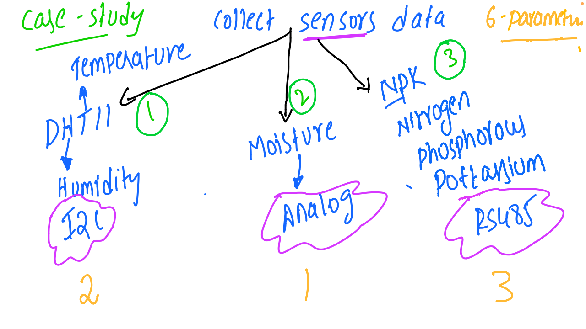

# IoT and Embedded Systems - Discussion 6

This document summarizes the sixth discussion in the IoT and Embedded Systems session, focusing on a case study of environmental monitoring using various sensors to measure key parameters like temperature, humidity, soil moisture, and soil nutrients.

---

## Table of Contents
1. [Case Study Overview](#case-study-overview)
2. [Sensors and Parameters Monitored](#sensors-and-parameters-monitored)
   - [Temperature and Humidity](#temperature-and-humidity)
   - [Soil Moisture](#soil-moisture)
   - [Soil Nutrients (NPK Levels)](#soil-nutrients-npk-levels)
3. [Sensor Communication Protocols](#sensor-communication-protocols)
4. [Session Diagram](#session-diagram)

---

## 1. Case Study Overview

The case study presented in this session covers the setup and integration of multiple sensors for environmental monitoring, focusing on agriculture and smart farming applications. Six essential parameters are monitored using different sensors, providing critical data for managing soil and environmental conditions effectively.

---

## 2. Sensors and Parameters Monitored

### Temperature and Humidity
- **Sensor**: **DHT11**
  - **Parameters Monitored**: Temperature and Humidity
  - **Communication Protocol**: **I2C**
  - **Description**: DHT11 is a digital sensor ideal for environmental monitoring applications, providing temperature and humidity data for applications such as greenhouse management.

### Soil Moisture
- **Sensor Type**: **Analog Soil Moisture Sensor**
  - **Parameter Monitored**: Soil Moisture Level
  - **Signal Type**: Analog
  - **Description**: This sensor measures the water content in the soil, which is critical for maintaining optimal soil conditions for plant growth and irrigation management.

### Soil Nutrients (NPK Levels)
- **Sensor Type**: **NPK Sensor** with **RS-485** Output
  - **Parameters Monitored**: Nitrogen (N), Phosphorus (P), and Potassium (K) levels
  - **Communication Protocol**: **RS-485**
  - **Description**: The NPK sensor provides data on the soil’s nutrient levels, allowing precise nutrient management in agriculture for improved crop yields.

---

## 3. Sensor Communication Protocols

The case study involves various communication protocols to interface each sensor with the microcontroller:
- **I2C (Inter-Integrated Circuit)**: Used by the DHT11 sensor to transmit temperature and humidity data.
- **Analog Output**: Used by the soil moisture sensor to provide a continuous signal representing moisture levels.
- **RS-485**: Utilized by the NPK sensor to communicate nutrient data over long distances, making it suitable for outdoor agricultural fields.

---

## 4. Session Diagram

