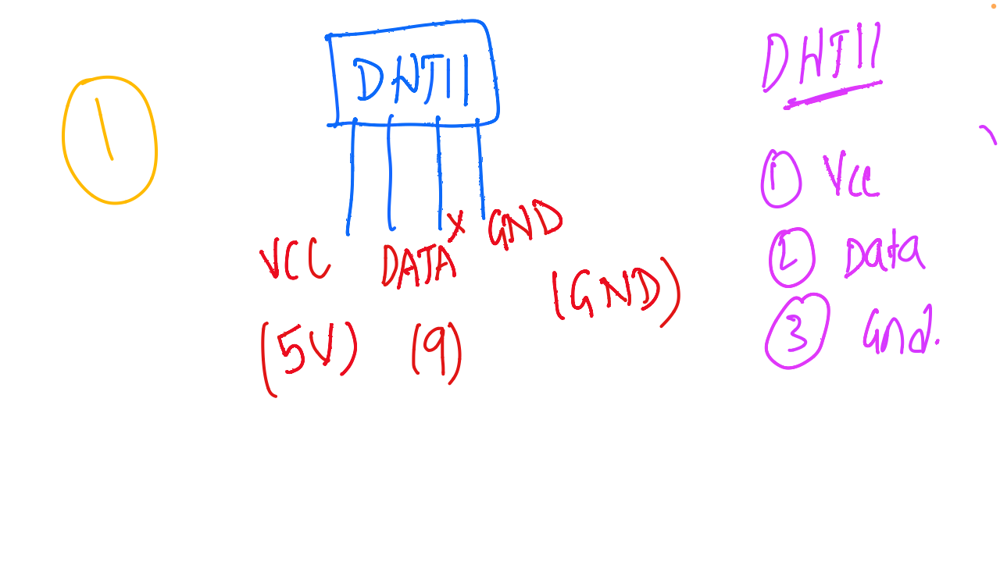

# IoT and Embedded Systems - Discussion 7

This document summarizes the seventh discussion in the IoT and Embedded Systems session, focusing on the DHT11 sensor, its pin configuration, and how to wire it for IoT applications involving temperature and humidity monitoring.

---

## Table of Contents
1. [Overview of DHT11 Sensor](#overview-of-dht11-sensor)
2. [Pin Configuration](#pin-configuration)
3. [Wiring the DHT11 Sensor](#wiring-the-dht11-sensor)
4. [Usage Notes](#usage-notes)
5. [Session Diagram](#session-diagram)

---

## 1. Overview of DHT11 Sensor

The **DHT11** sensor is a digital sensor commonly used in IoT projects to measure temperature and humidity. It is popular due to its simplicity, affordability, and reliability in environmental monitoring applications.

---

## 2. Pin Configuration

The DHT11 sensor has three primary pins:
1. **VCC**: Power supply pin, typically connected to 5V.
2. **DATA**: The data output pin that sends the temperature and humidity readings to the microcontroller.
3. **GND**: Ground pin to complete the circuit.

---

## 3. Wiring the DHT11 Sensor

### Pin Descriptions and Wiring
- **VCC (5V)**: Supplies power to the sensor. Connect this pin to the 5V pin on the microcontroller.
- **DATA**: The output pin that transmits data from the sensor. Connect this to a digital input pin on the microcontroller (e.g., pin 9).
- **GND**: Connect this pin to the ground (GND) of the microcontroller.

### Example Wiring
- Connect the **VCC** pin of the DHT11 to the 5V power supply on the microcontroller.
- Connect the **DATA** pin to a digital input pin (e.g., pin 9) on the microcontroller to receive temperature and humidity data.
- Connect the **GND** pin to the ground pin on the microcontroller.

---

## 4. Usage Notes

- **Power Requirements**: The DHT11 sensor operates best at 5V, so make sure to provide a stable power source.
- **Data Transmission**: The DATA pin outputs a digital signal, which can be read by a microcontroller to obtain temperature and humidity measurements.
- **Applications**: Ideal for applications in environmental monitoring, smart homes, and greenhouse management.

---

## 5. Session Diagram

