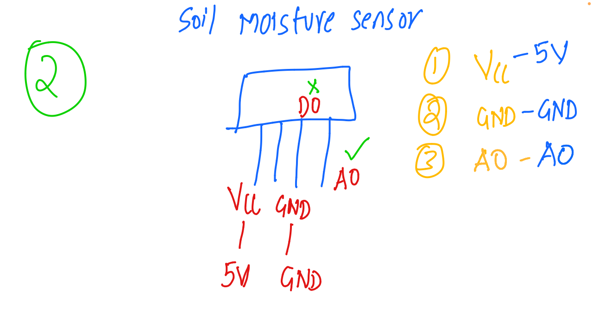

# IoT and Embedded Systems - Discussion 8

This document summarizes the eighth discussion in the IoT and Embedded Systems session, focusing on the soil moisture sensor, its pin configuration, and how to wire it for IoT applications in environmental monitoring and smart irrigation.

---

## Table of Contents
1. [Overview of Soil Moisture Sensor](#overview-of-soil-moisture-sensor)
2. [Pin Configuration](#pin-configuration)
3. [Wiring the Soil Moisture Sensor](#wiring-the-soil-moisture-sensor)
4. [Usage Notes](#usage-notes)
5. [Session Diagram](#session-diagram)

---

## 1. Overview of Soil Moisture Sensor

The **Soil Moisture Sensor** is a device used in IoT applications to measure the water content in soil. It provides data that can be used for automated irrigation systems and other agriculture-related IoT projects, ensuring optimal moisture levels for plant growth.

---

## 2. Pin Configuration

The soil moisture sensor has three primary pins:
1. **VCC**: Power supply pin, typically connected to 5V.
2. **GND**: Ground pin to complete the circuit.
3. **A0 (Analog Output)**: Outputs an analog signal that corresponds to the soil moisture level.

Additionally, some sensors also have:
- **D0 (Digital Output)**: Outputs a digital signal based on a predefined threshold. This pin is optional depending on the model.

---

## 3. Wiring the Soil Moisture Sensor

### Pin Descriptions and Wiring
- **VCC (5V)**: Supplies power to the sensor. Connect this pin to the 5V pin on the microcontroller.
- **GND**: Connect this pin to the ground (GND) of the microcontroller.
- **A0 (Analog Output)**: Connect this to an analog input pin on the microcontroller to read the soil moisture level as a continuous variable.
- **D0 (Digital Output)** (if available): Can be connected to a digital input pin for threshold-based monitoring.

### Example Wiring
- Connect the **VCC** pin of the soil moisture sensor to the 5V supply on the microcontroller.
- Connect the **GND** pin to the ground on the microcontroller.
- Connect the **A0** pin to an analog input pin (e.g., A0) on the microcontroller to read moisture levels.

---

## 4. Usage Notes

- **Power Requirements**: The soil moisture sensor typically requires a 5V power supply.
- **Analog vs. Digital Output**:
  - **Analog Output (A0)** provides a variable reading of soil moisture, ideal for applications that need precise moisture levels.
  - **Digital Output (D0)** can be used for simple applications where only wet/dry states are needed, based on a preset threshold.
- **Applications**: Widely used in smart agriculture for irrigation control, greenhouse monitoring, and other plant care systems.

---

## 5. Session Diagram

