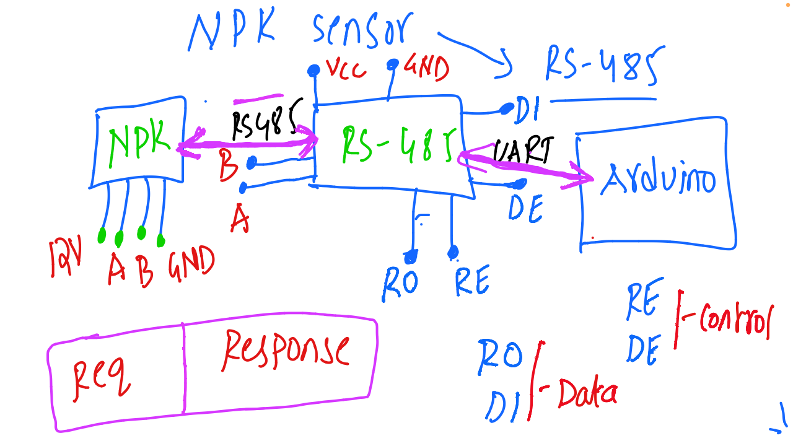

# IoT and Embedded Systems - Discussion 9

This document summarizes the ninth discussion in the IoT and Embedded Systems session, focusing on interfacing an NPK sensor with an Arduino through an RS-485 communication module. This setup is widely used in agricultural applications for monitoring soil nutrient levels over long distances.

---

## Table of Contents
1. [Overview of NPK Sensor](#overview-of-npk-sensor)
2. [Components Used](#components-used)
3. [Wiring and Connections](#wiring-and-connections)
4. [RS-485 Communication Protocol](#rs-485-communication-protocol)
5. [Session Diagram](#session-diagram)

---

## 1. Overview of NPK Sensor

The **NPK Sensor** is used to measure the levels of Nitrogen (N), Phosphorus (P), and Potassium (K) in the soil. These nutrients are essential for plant growth, and monitoring them helps in precision agriculture, optimizing fertilizer usage based on soil conditions.

---

## 2. Components Used

- **NPK Sensor**: Measures soil nutrient levels.
- **RS-485 Module**: Enables differential communication for long-distance data transmission.
- **Arduino**: Microcontroller that interfaces with the RS-485 module and processes data from the NPK sensor.

---

## 3. Wiring and Connections

### NPK Sensor Connections
- **VCC**: Connect to a 12V power source.
- **A and B**: Differential data lines for RS-485 communication.
- **GND**: Ground pin to complete the circuit.

### RS-485 Module Connections
- **VCC**: Connect to the Arduino’s 5V pin.
- **GND**: Connect to the Arduino’s GND and the NPK sensor’s GND.
- **DI (Data Input)**: Connect to the Arduino for sending requests to the NPK sensor.
- **RO (Receive Output)**: Connect to the Arduino for receiving data from the NPK sensor.
- **DE (Data Enable)** and **RE (Receive Enable)**: Control pins to toggle between sending and receiving modes.

### Arduino Connections
- **DI and RO**: Connected to the appropriate digital pins on the Arduino for data input and output.
- **DE and RE**: Connected to control pins on the Arduino to switch between transmit and receive modes.

---

## 4. RS-485 Communication Protocol

- **Differential Communication**: RS-485 uses two wires (A and B) for data transmission, making it suitable for long-distance communication in noisy environments.
- **Control Pins**:
  - **DE (Data Enable)** and **RE (Receive Enable)** are used to toggle the RS-485 module between sending (request) and receiving (response) modes.
- **Request-Response Flow**:
  - **Request**: Arduino sends a request to the NPK sensor via the RS-485 module to retrieve nutrient levels.
  - **Response**: The NPK sensor sends back data, which the Arduino reads via the RS-485 module.

---

## 5. Session Diagram

